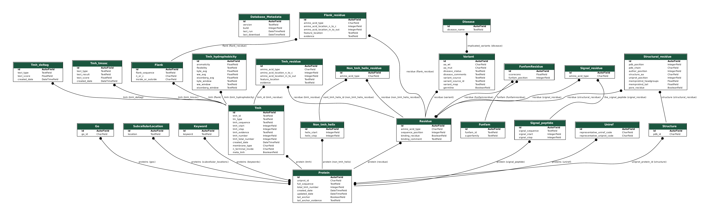

# VarTMH: Database of Variants in Transmembrane Helices

## Aims

This is a tool to help to evaluate coding SNP disease variants in the context of transmembrane proteins.
It curates TMHs boundaries and topology from several sources and cross references those against several variant databases.

1.  TMHs in TMPs are enriched for disease at a proteomic scale.

    -   Bar plot showing TMP disease variants per residue versus gnomAD variants per residue. _TMHs are enriched for disease variants_.
    -   Statistics showing a difference between these two sets. _Disease variant enrichment in TMHs is significant_.

2.  The types of residue SNPs that cause disease are different in TMHs than other regions of TMPs at a proteome scale.

    -   Show mutability of each residue in different conditions (bar plots for all residues, then TMH, non-TMH, inside flank, outside flank). _Mutability varies between TMHs and non-TMHs_.
    -   Disease propensity in proteomic TMH/non-TMH. _Disease effect for a given variant type is generally different between TMHs and non TMHs_.

3.  Different types of amino acid variants in TMHs cause disease depending on context.

    -   Split TMPs into Single pass, multi pass, and tail anchored proteins and use disease propensity heatmaps. _Within populations of TMHs, functional context matters for variant effect_.
    -   GPCRs and ion channels disease propensity heatmaps. _Evolutionarily distinct groups of proteins are effected differently by variance in terms of disease_.
    -   Split TMHs into the most hydrophobic/TMSOC z-score/von Heijne delta G. Compare the top and bottom quartile. _The anchoring potential of a TMH alters the variant effect_.

4.  Structural analysis can enrich our understanding of the variant effect. _The physicochemical context of a residue in a TMH alters the variant effect_.

    -   disease propensity heatmap for head contact group residues (including homologous residues and their variants)
    -   disease propensity heatmap for tail contact group residues (including homologous residues and their variants)
    -   disease propensity heatmap for pore facing residues (including homologous residues and their variants)

## Abstract

Around 25% of human proteins are membrane-bound.
However, membrane proteins account for more than 40% of drug targets, which demonstrates their importance in biology, therapeutics, and disease.
The defining region of these proteins is the membrane-embedded region.
The membrane imposes biophysical constraints that are reflected in the amino acid composition.
Crucially these regions contain a relatively high frequency of hydrophobic residues as well as more subtle factors such as the positive-inside rule and the aromatic belt.
Evidence in the literature suggests coding variants in these regions generally have different effects than a similar amino acid change in a soluble region.  
Here, we took genomic disease single nucleotide variants from gnomAD (non-disease variants), ClinVar (disease variants), Humsavar (disease variants), and mapped them to their position in the coding proteins.
We cross-referenced these positions with transmembrane boundaries from several sources.
We then stratified the proteins into families, sub-cellular locations, topology, and function.
This allowed us to examine the nuances of how different variants impact transmembrane proteins in the context of the biophysical environment and evolutionary history.
As well as gaining an understanding of the concepts of disease variants in transmembrane proteins, the tools we have developed will increase the ability to predict the variant effect in the biochemically distinct membrane regions.

## Back-end structure

The current database structure is laid out below. The key thing to keep in mind is that all records are centered around the UniProt id and UniProt sequence.

### Installation

1.  `git clone https://github.com/JamesABaker/VarTMH.git`
2.  `pip install -r requirements` I suggest working in a virtual environment for this.
3.  Change the `tmh_database/settings.py` to your server settings.
4.  `bash populate.sh`
5.  `bash summary.sh`

## Back-end sources and references

Several external tools are needed to generate the database. External programmes, software, and datasets are listed below.

**UniProt** `external_datasets/uniprot_bin/*.txt` <https://www.uniprot.org/> Bateman, A. et al. UniProt: the universal protein knowledgebase. Nucleic Acids Res. 45, D158–D169 (2017).

**TopDB** `external_datasets/topdb_all.xml` from <http://topdb.enzim.hu> Dobson, L., Langó, T., Reményi, I. & Tusnády, G. E. Expediting topology data gathering for the TOPDB database. Nucleic Acids Res. 43, D283–D289 (2015).

**MPTOPO** `external_datasets/mptopoTblXml.xml` from <http://blanco.biomol.uci.edu/mptopo/> Jayasinghe, S. MPtopo: A database of membrane protein topology. Protein Sci. 10, 455–458 (2001).

**OPM** `external_datasets/opm/*.txt` from <https://opm.phar.umich.edu/> Lomize, M. A., Pogozheva, I. D., Joo, H., Mosberg, H. I. & Lomize, A. L. OPM database and PPM web server: resources for positioning of proteins in membranes. Nucleic Acids Res. 40, D370–D376 (2012).

**TMSOC** `embedded` from <http://tmsoc.bii.a-star.edu.sg/> Wong, W.-C., Maurer-Stroh, S., Schneider, G. & Eisenhaber, F. Transmembrane helix: simple or complex. Nucleic Acids Res. 40, W370–W375 (2012).

<!--
**CD-HIT** from <https://github.com/weizhongli/cdhit> Huang, Y., Niu, B., Gao, Y., Fu, L. & Li, W. CD-HIT Suite: A web server for clustering and comparing biological sequences. Bioinformatics 26, 680–682 (2010).
-->

**FunFams in CATH** `API` from <http://www.cathdb.info> Sillitoe, I. et al. New functional families (FunFams) in CATH to improve the mapping of conserved functional sites to 3D structures. Nucleic Acids Res. 41, D490–D498 (2012).

**ΔG TM insertion** `external_scripts/dgpred/` from <https://github.com/ElofssonLab/dgpred> Hessa, T. et al. Molecular code for transmembrane-helix recognition by the Sec61 translocon. Nature 450, 1026–1030 (2007). 

### Thanks

Many thanks to [Antonio](https://github.com/jose-mr) and [Ian](https://github.com/sillitoe) for their contributions in debugging and optimising the code. Thanks to all the curators of the referenced tools for making their resources available.
