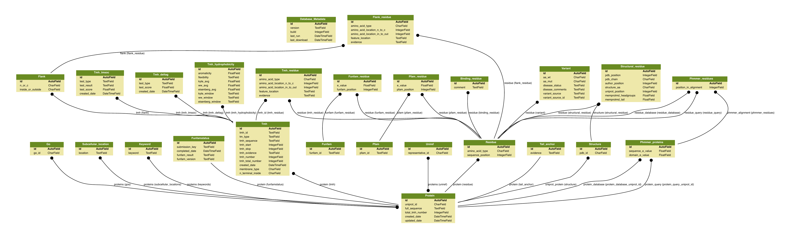

# VarTMH: Database of Variants in Transmembrane Helices

## Aims

This is a tool to help to evaluate disease variants in the context of transmembrane proteins.
It curates TMHs boundaries and topology from several sources and cross references those against several variant databases.

## Statistics

**Figure** This is the number of disease variants per residue in transmembrane and non transmembrane regions held in the database. Disease variants are enriched in transmembrane helix regions compared to non-transmembrane helical regions of transmembrane proteins.

**Figure** This is the number of gnomAD variants per residue in transmembrane and non transmembrane regions held in the database.

## Back-end structure

The current database structure is laid out below. The key thing to keep in mind is that all records are centered around the UniProt id and UniProt sequence.

### Installation
 1. `git clone https://github.com/JamesABaker/VarTMH.git`
 2. `pip install -r requirements` I suggest working in a virtual environment for this.
 3. Change the `tmh_database/settings.py` to your server settings.
 3. `bash populate.sh`
 4. `bash db_summary.sh`

## Back-end sources and references

Several external tools are needed to generate the database. External programmes, software, and datasets are listed below.

**UniProt** `external_datasets/uniprot_bin/*.txt` <https://www.uniprot.org/> Bateman, A. et al. UniProt: the universal protein knowledgebase. Nucleic Acids Res. 45, D158–D169 (2017).

**TopDB** `external_datasets/topdb_all.xml` from <http://topdb.enzim.hu> Dobson, L., Langó, T., Reményi, I. & Tusnády, G. E. Expediting topology data gathering for the TOPDB database. Nucleic Acids Res. 43, D283–D289 (2015).

**MPTOPO** `external_datasets/mptopoTblXml.xml` from <http://blanco.biomol.uci.edu/mptopo/> Jayasinghe, S. MPtopo: A database of membrane protein topology. Protein Sci. 10, 455–458 (2001).

**OPM** `external_datasets/opm/*.txt` from <https://opm.phar.umich.edu/> Lomize, M. A., Pogozheva, I. D., Joo, H., Mosberg, H. I. & Lomize, A. L. OPM database and PPM web server: resources for positioning of proteins in membranes. Nucleic Acids Res. 40, D370–D376 (2012).

**TMSOC** `embedded` from <http://tmsoc.bii.a-star.edu.sg/> Wong, W.-C., Maurer-Stroh, S., Schneider, G. & Eisenhaber, F. Transmembrane helix: simple or complex. Nucleic Acids Res. 40, W370–W375 (2012).

<!--
**CD-HIT** from <https://github.com/weizhongli/cdhit> Huang, Y., Niu, B., Gao, Y., Fu, L. & Li, W. CD-HIT Suite: A web server for clustering and comparing biological sequences. Bioinformatics 26, 680–682 (2010).
-->

**FunFams in CATH** `API` from <http://www.cathdb.info> Sillitoe, I. et al. New functional families (FunFams) in CATH to improve the mapping of conserved functional sites to 3D structures. Nucleic Acids Res. 41, D490–D498 (2012).

**ΔG TM insertion** `external_scripts/dgpred/` from <https://github.com/ElofssonLab/dgpred> Hessa, T. et al. Molecular code for transmembrane-helix recognition by the Sec61 translocon. Nature 450, 1026–1030 (2007).

### Thanks

Many thanks to [Antonio](https://github.com/jose-mr) and [Ian](https://github.com/sillitoe) for their contributions in debugging and optimising the code. Thanks to all the curators of the referenced tools for making their resources available.
